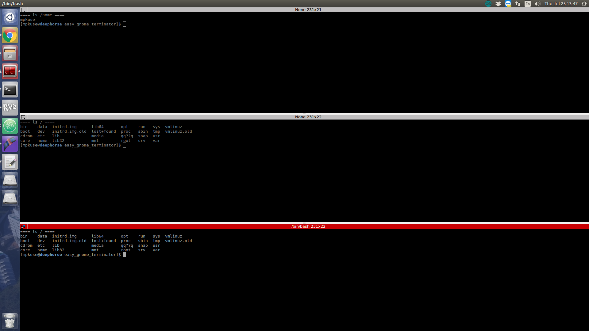
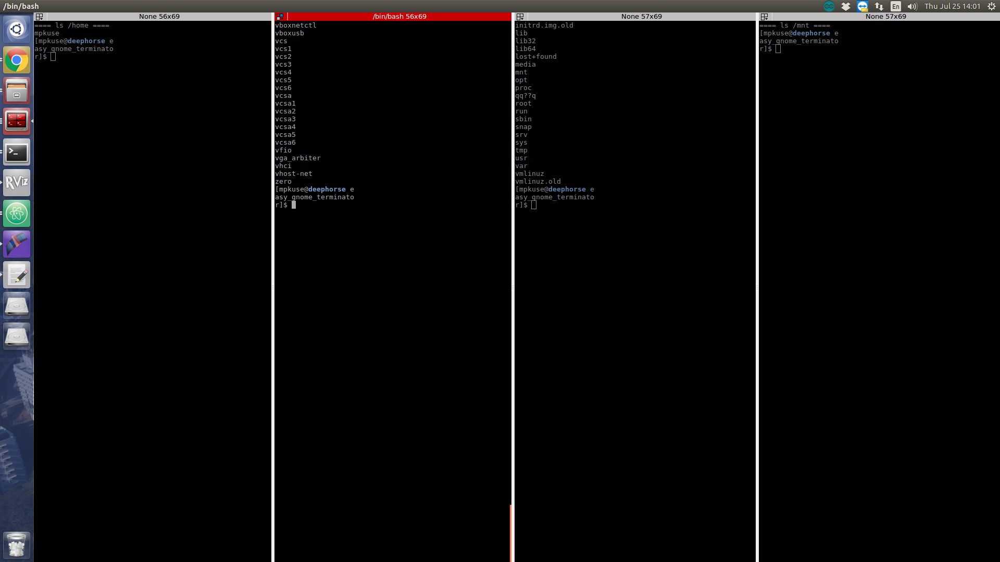

# Programatically Generate Config files for Gnome Terminator

A collection of scripts to open multiple splits in the terminator
with specified commands in each of the splits.

## Scripts

### vertical_n.py

```
python vertical_n.py  > /tmp/terminator_config  ; terminator -g /tmp/terminator_config
```




### horizontal_n.py


```
python horizontal_n.py  > /tmp/terminator_config  ; terminator -g /tmp/terminator_config
```



### grid_nxm.py
todo

## TODO
Use arg_parse to make all ready scripts more user friendly.

PR welcome!

## Contributors
Manohar Kuse <mpkuse@connect.ust.hk> <https://github.com/mpkuse/>
